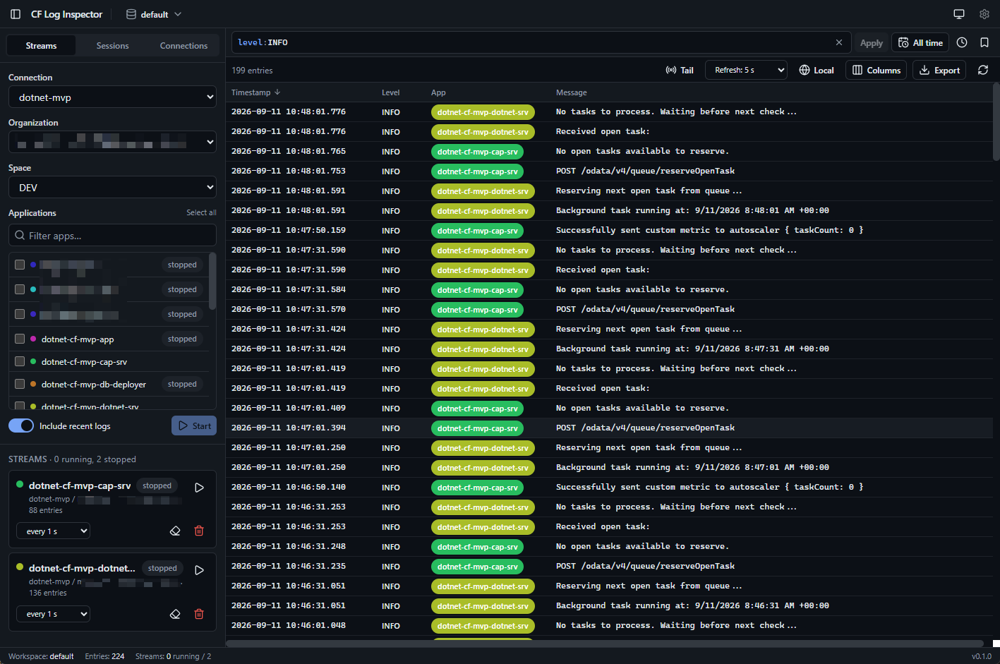

# CF Log Inspector

A cross-platform desktop app for streaming, storing, and searching Cloud Foundry application logs — no `cf` CLI required.



## Overview

CF Log Inspector replaces `cf logs <app> [--recent]` in a terminal with a native desktop experience. It logs in to Cloud Foundry (including SAP BTP) spaces directly, streams logs from one or many apps at once via the Log Cache API, stores them in local SQLite workspaces so they survive a restart, and gives you a fast, filterable log table with a query language, time filtering, and export.

It is built with Electron and runs on Linux, Windows, and macOS.

## Features

- **Native Cloud Foundry login** — username/password, custom identity provider (origin), or SSO passcode flow. No `cf` CLI installation needed.
- **Multiple connection profiles** — pick a foundation from a built-in SAP BTP region catalog or enter any custom API URL, with per-connection TLS options (skip SSL validation, custom CA).
- **Org / space / app picker** — select multiple apps and start streaming them together, with optional backfill of recent logs (like `cf logs --recent`).
- **Live tail** — automatic reconnect with backoff, and automatic pause/resume when authentication expires.
- **Persistent local storage** — logs are saved into named, switchable SQLite workspace files, not just held in memory. Configurable retention limits (max rows per session and per workspace).
- **DQL-style query language** — filter with expressions like `level:error and app:my-app`, wildcards, ranges, and free text, in a CodeMirror-based query bar with syntax highlighting, inline lint errors, field/value/operator autocomplete, query history, and named saved filters.
- **Time range filtering** — quick picks (last 5 minutes to 7 days), custom relative ranges, absolute ranges, or all time.
- **Auto-refresh and tail mode** — refresh on an interval or follow new entries live; tailing pauses automatically when you scroll up or hover the table.
- **Configurable log table** — sortable, resizable columns with virtualized scrolling for large volumes. Columns for JSON fields found in log payloads are added automatically, and the column layout is remembered per workspace.
- **Row detail panel** — full message view, an expandable JSON tree with per-value copy, the raw payload, and one-click "filter for" / "filter out" on any field.
- **Multi-row selection** — click, Ctrl/Shift, and keyboard navigation, with copy-as-NDJSON.
- **Export** — filtered results, or just the selected/loaded rows, to NDJSON, JSON, or CSV.
- **Session management** — scope the view to one or more streaming sessions, or jump the time filter to a session's exact time span.
- **Light / dark / system theme.**

## Installation

### Download a release

Tagged releases (`vX.Y.Z`) are built for Windows, macOS, and Linux by a GitHub Actions workflow and published as a [GitHub Release](https://github.com/DevEpos/cf-logs-inspector/releases). Download the installer for your platform from there.

Builds are currently **unsigned** (no code signing, no auto-update yet), so your OS may warn about an unrecognized publisher on first launch.

### Build from source

Alternatively, build it yourself from source and package it for your own platform.

### Prerequisites

- Node.js >= 22
- pnpm (via `corepack enable` or `npm install -g pnpm`)
- A working native build toolchain, since the app depends on the native module `better-sqlite3` (this is rebuilt for Electron automatically via the `postinstall` script)

### Build a local installer

```bash
git clone <this-repo-url>
cd cf-log-inspector
pnpm install
pnpm package
```

`pnpm package` produces an installer for your current platform under `release/`:

| Platform | Output |
|---|---|
| Windows | NSIS installer (`.exe`) and `.zip` |
| macOS | `.dmg` and `.zip` (category: Developer Tools) |
| Linux | `.AppImage` and `.zip` (category: Development) |

## Getting Started

1. **Launch the app.** It opens with a default local SQLite workspace already created.
2. **Add a connection.** Give it a name, then either pick a region from the built-in SAP BTP catalog or enter a custom API URL. Choose a login mode — password, custom identity provider (origin), or SSO passcode — and, for self-hosted foundations, configure TLS options if needed.
3. **Log in.** For password/origin logins this happens inline; the SSO passcode flow opens a login window and also lets you paste the temporary passcode manually if the window flow doesn't complete.
4. **Open the Streams panel.** Pick the connection, org, and space, then select one or more apps to stream. Toggle whether to backfill recent logs before tailing starts.
5. **Watch logs arrive live.** Use the query bar to filter with DQL syntax, set a time range, and toggle tail mode or an auto-refresh interval.
6. **Inspect a log entry.** Click a row to see the full message, a JSON tree view, and the raw payload, with shortcuts to filter for or against any field value. Select multiple rows to copy them as NDJSON.
7. **Export results** — filtered, selected, or currently loaded rows — to NDJSON, JSON, or CSV.
8. **Use workspaces to stay organized.** Switch or create additional workspaces to keep separate investigations isolated, and adjust retention settings per workspace.

## Development

### Tech stack

- Electron + TypeScript, built with electron-vite, managed with pnpm, Node >= 22
- React 19, TanStack Table / Virtual / Query
- Tailwind 4 + Radix UI (shadcn-style components)
- CodeMirror 6 (query bar)
- zustand (UI state)
- better-sqlite3 (local storage), zod (validation)
- vitest (tests)

### Architecture

The main process is the only part of the app that talks to Cloud Foundry, UAA, and the Log Cache API (over plain HTTP), and it owns all SQLite storage. The renderer never touches the network directly — production builds enforce this with a `connect-src 'none'` Content Security Policy — and communicates with the main process only through a typed IPC bridge exposed via the preload script.

### Setup

```bash
pnpm install
```

This also rebuilds `better-sqlite3` for Electron via the `postinstall` script.

### Common commands

| Command | Description |
|---|---|
| `pnpm dev` | Start Electron with hot reload |
| `pnpm test` | Run the vitest suite (runs under Electron's Node so the native `better-sqlite3` binary loads) |
| `pnpm test:watch` | Run tests in watch mode |
| `pnpm test:node` | Run tests under plain Node/vitest instead of Electron |
| `pnpm typecheck` | Type-check the whole project |
| `pnpm lint` | Run eslint |
| `pnpm format` | Format the codebase with prettier |
| `pnpm build` | Bundle main/preload/renderer into `out/` |
| `pnpm package` | Build installers with electron-builder into `release/` |

### Code style

- Strict TypeScript throughout.
- Prettier formatting: single quotes, 100-character width, trailing commas.
- ESLint for linting.
- Tests are table-driven and colocated in `__tests__` folders next to the code they cover.

### CI / releases

- Every push and pull request runs lint, typecheck, and the test/build matrix (Ubuntu, Windows, macOS) via [`.github/workflows/ci.yml`](.github/workflows/ci.yml).
- Pushing a tag matching `v*.*.*` triggers [`.github/workflows/release.yml`](.github/workflows/release.yml), which builds and publishes installers for all three platforms into a single draft GitHub Release for manual review before publishing.

### Project status

CF Log Inspector is an actively developed, pre-1.0 project. Core functionality — streaming, local storage, the query engine, the main UI, export/session management, and packaging/CI — is implemented. Verification against real Cloud Foundry foundations and code signing/auto-update are still outstanding. See [docs/DEVELOPMENT_PLAN.md](docs/DEVELOPMENT_PLAN.md) for the authoritative, up-to-date architecture and milestone status.

### Learn more / contributing

- [docs/DEVELOPMENT_PLAN.md](docs/DEVELOPMENT_PLAN.md) — full architecture, data model, and milestone plan.
- [CLAUDE.md](CLAUDE.md) — detailed per-milestone implementation notes and coding conventions used in this repo's AI pair-programming sessions.

Contributions are welcome — please run `pnpm typecheck`, `pnpm lint`, and `pnpm test` before opening a pull request.

## License

MIT
